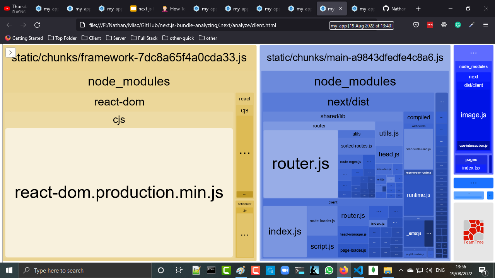

<h2>Motivation</h2>
next.js has big imact on performance via
<ul>
<li>page pre rendering : SSG \ ISR \ SSR</li>
<li>Image optimization via Image component (and sharp??)</li>
<li>Code spliting</li>
</ul>

but you might want to further optimize your application performance by analyzing the bundle. And this can be done by @next/bundle-analyzer as described <a href='https://flaviocopes.com/nextjs-analyze-app-bundle/'>here</a>


<h2>Setup</h2>

Add the following to scripts in package.json

```json
    "analyze": "cross-env ANALYZE=true next build",
    "analyze:server": "cross-env BUNDLE_ANALYZE=server next build",
    "analyze:browser": "cross-env BUNDLE_ANALYZE=browser next build"
```    

Install the following 

```cmd
npm install --dev cross-env @next/bundle-analyzer
```

Create a next.config.js file in the project root, with this content

```js
const withBundleAnalyzer = require('@next/bundle-analyzer')({
  enabled: process.env.ANALYZE === 'true'
})

module.exports = withBundleAnalyzer({})

```

 run the command

 ```
npm run analyze 
 ```

<h2>Analyze output</h2>

<h3>text ouput</h3>
text output of the analyzer

 


 <h3>server html</h3>
server html output of the analyzer


<h3>client html</h3>
 
client html output of the analyzer


